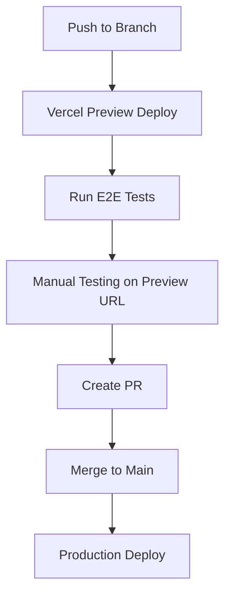

# Family Hub 👨‍👩‍👧‍👦

A minimalist family management web app inspired by Things 3's clean aesthetic, designed for efficient family coordination and task management.

## ✨ Features

- **Task Management**: Things 3-inspired task organization with time groups and family assignments
- **Smart Grocery Lists**: Template-based shopping with purchase history
- **Family Calendar**: Color-coded calendar with event sharing
- **Real-time Sync**: Instant updates across all family members' devices
- **Cloud-Only Development**: No localhost required - develop entirely in the cloud

## 🏗️ Architecture

- **Frontend**: Next.js 14 + TypeScript + Tailwind CSS
- **Backend**: Supabase (PostgreSQL + Auth + Real-time)
- **Deployment**: Vercel with preview deployments
- **Development**: GitHub Codespaces + automated testing

## 🚀 Quick Start (Cloud Development)

1. **Open in Codespaces**:
   ```bash
   # Click "Code" → "Codespaces" → "Create codespace"
   # Environment automatically configured with all dependencies
   ```

2. **Install Dependencies**:
   ```bash
   npm install
   ```

3. **Setup Environment**:
   ```bash
   cp .env.example .env.local
   # Add your Supabase credentials
   ```

4. **Start Development**:
   ```bash
   npm run dev
   # Automatic preview deployment created on push
   ```

## 🌐 Deployment Workflow



## 🧪 Testing

All testing happens in the cloud - no local setup required:

- **E2E Tests**: Playwright on preview deployments
- **Unit Tests**: Jest + React Testing Library
- **API Tests**: Supabase integration testing
- **Performance**: Lighthouse CI on all deployments

```bash
# Tests run automatically on preview deployments
# Manual testing: preview-{branch}.vercel.app
```

## 📁 Project Structure

```
src/
├── app/                    # Next.js 14 App Router
├── components/             # Reusable UI components
├── lib/                    # Utilities and configurations
└── types/                  # TypeScript type definitions

supabase/
├── migrations/             # Database schema changes
└── seed.sql               # Test data

tests/
├── e2e/                   # End-to-end tests
├── unit/                  # Component unit tests
└── api/                   # API endpoint tests
```

## 🎨 Design System

- **Colors**: Family member color coding (Blue, Red, Green, Purple)
- **Typography**: SF Pro Display / Inter
- **Layout**: 8px grid system, 10px border radius
- **Animations**: Framer Motion with subtle transitions

## 👥 Family Members

- **Gonzalo**: Blue (#007AFF)
- **María Paz**: Red (#FF3B30)
- **Borja**: Green (#34C759)
- **Melody**: Purple (#AF52DE)

## 🔐 Security

- **Authentication**: Supabase Auth with email/password
- **Data Isolation**: Row Level Security for family privacy
- **HTTPS**: SSL encryption for all connections
- **Environment Variables**: Secure credential management

## 📊 Success Metrics

- **Performance**: <2s load time
- **Uptime**: 99.9% availability
- **Usage**: Daily active usage by all family members
- **Efficiency**: 90% grocery reuse from templates

## 🛠️ Development Commands

```bash
npm run dev          # Start development (auto-deployed)
npm run build        # Build for production
npm run test         # Run unit tests
npm run test:e2e     # Run E2E tests (on preview URL)
npm run lint         # Lint code
npm run type-check   # TypeScript validation
```

## 📈 Roadmap

- **Phase 1**: Foundation (Auth, Tasks, Basic Grocery List)
- **Phase 2**: Real-time Sync and Core Features
- **Phase 3**: Calendar Integration
- **Phase 4**: Smart Features and Polish

## 🤝 Contributing

1. Create feature branch
2. Develop in Codespaces (automatic preview deployment)
3. Test on preview URL
4. Create PR (tests must pass)
5. Merge to main (automatic production deployment)

## 📄 License

Private family project - All rights reserved.

---

Built with ❤️ for the Gonzalo family using modern web technologies and cloud-first development practices.